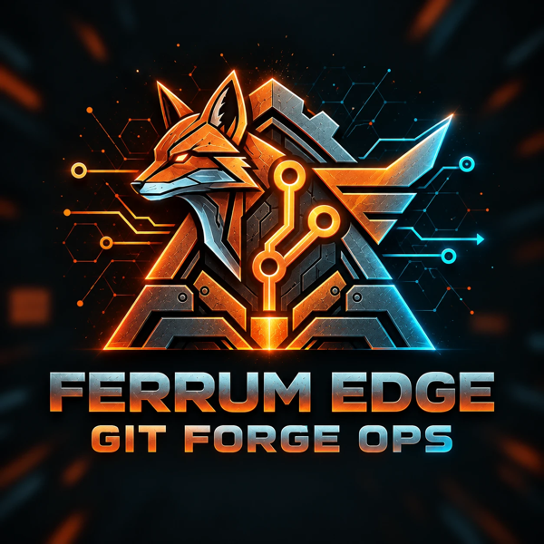

<p align="center">
  
</p>

<h1 align="center">Ferrum Edge GitForgeOps</h1>

<p align="center">GitOps for <a href="https://github.com/ferrum-edge/ferrum-edge">Ferrum Edge</a> — review, apply, and monitor gateway configuration through pull requests</p>

<p align="center">
  <a href="https://github.com/ferrum-edge/ferrum-edge-git-forge-ops/actions/workflows/rust-ci.yml"></a>
  <a href="https://github.com/ferrum-edge/ferrum-edge-git-forge-ops/actions/workflows/security.yml"></a>
  <a href="https://github.com/ferrum-edge/ferrum-edge-git-forge-ops/actions/workflows/release.yml"></a>
  <a href="https://github.com/ferrum-edge/ferrum-edge-git-forge-ops/blob/main/LICENSE.md"></a>
  
  <a href="https://hub.docker.com/r/ferrumedge/ferrum-edge-git-forge-ops"></a>
</p>

> **Active build-out:** breaking changes to the CLI, configuration, and state
> formats are expected until the first supported baseline. See
> [Development status](#development-status).

GitOps for [Ferrum Edge](https://github.com/ferrum-edge/ferrum-edge) gateway
configuration. Gateway resources live in this repository as YAML; pull requests
are validated and reviewed against the live gateway; merges are applied per
environment; and a nightly check reports drift. Everything runs on GitHub
Actions, Environments, Secrets and APIs, with no third-party secret manager.

This repository is a template. Copy it, configure it, and follow
[Set up your own repository](#set-up-your-own-repository), or take the short
path in the [Quickstart](docs/quickstart.md). Check
[GitHub plan requirements](#github-plan-requirements) before choosing a
repository shape.

## Contents

| Get started | Operate | Reference |
|---|---|---|
| [How it works](#how-it-works) | [Ownership modes](#ownership-modes) | [CLI](#cli) |
| [GitHub plan requirements](#github-plan-requirements) | [Policy framework](#policy-framework-gitforgeopspoliciesyaml) | [Repo configuration](#repo-configuration-gitforgeopsconfigyaml) |
| [Set up your own repository](#set-up-your-own-repository) | [Credential broker](#credential-broker-gh-env-secret-placeholders) | [Mesh configuration](#mesh-configuration) |
| [Quickstart guide](docs/quickstart.md) | [Apply and recovery](#apply-and-recovery) | [Trust and security posture](#trust-and-security-posture) |
| [Repository layout](#repository-layout) | [Staged promotion](#staged-promotion) | [Docker](#docker) |
| [Adopting an existing gateway](#adopting-an-existing-gateway) | [Drift detection](#drift-detection) | [Development](#development) |
| [Setup doctor](#setup-doctor) | [Upgrading](#upgrading) | [License](#license) |

## Development status

First supported baseline: [v0.1.0](release/README.md). The committed
[upstream release record](https://github.com/ferrum-edge/ferrum-edge-git-forge-ops/blob/main/release/baseline.json)
is the source of truth for status and for the exact component pairing:

- While its `status` is `pending`, GitForgeOps is in active buildout with no
  supported release or users. Expect breaking changes to the CLI,
  configuration and state formats.
- Once `status` becomes `supported`, use only the source SHA, image digest,
  validator pin and gateway pairing in that record. Earlier buildout revisions
  have no compatibility or upgrade commitment.

The [release policy and adoption steps](release/README.md#publishing-and-later-changes)
apply from that baseline onward.

GitForgeOps has **no database**. Gateway resource types are defined in
[`src/config/schema.rs`](src/config/schema.rs), environment and policy
configuration in [`src/config/repo_config.rs`](src/config/repo_config.rs) and
[`src/policy/config.rs`](src/policy/config.rs), and the JSON ownership ledger in
[`src/state.rs`](src/state.rs). If a database is ever added during buildout,
keep its schema in one initial baseline; see the
[contributor policy](CLAUDE.md#buildout-and-schema-policy).

## Features

- **Many environments, one repository.** Declare staging, production and
  others in `.gitforgeops/config.yaml`; each deploys to its own gateway through
  its own GitHub Environment.
- **Ownership modes.** `shared` (default) only touches what the repository has
  applied; `exclusive` makes the repository authoritative for a set of
  namespaces.
- **Policy rules.** Opt-in checks (timeout bands, TLS-only backends, required
  authentication, WAF, AI guardrails, ...) appear in PR review, and
  `severity: error` blocks apply unless a maintainer overrides it on the PR.
- **Credential broker.** Resource files hold `${gh-env-secret:...}`
  placeholders. Values are generated at apply time, stored in GitHub
  Environment Secrets, and delivered age-encrypted to the PR author.
- **Mesh configuration.** `MeshConfig` fragments merge into one standalone
  mesh document for file-protocol mesh nodes.
- **Staged promotion.** An environment can wait until another has applied the
  same revision and passed declared traffic checks.
- **Drift detection** that understands ownership, so shared-mode noise stays
  quiet.

## How it works

1. A pull request changes files under `resources/` or `overlays/`.
2. `validate-pr.yml` builds the PR's code and validates it statically, with no
   secrets and no GitHub Environment.
3. `trusted-pr-review.yml` then runs the protected-branch binary on a
   sanitized copy of the PR's YAML, waits for environment approval, compares it
   with the live gateway, and posts a review comment. Fork PRs get static
   review only.
4. After merge, `apply-on-merge.yml` applies each environment in its own job,
   bound to its GitHub Environment, and commits the ownership ledger
   (`.state/<env>.json`) back to `main`.
5. `drift-check.yml` compares each gateway with the repository every night.

| Workflow | Trigger | Purpose |
|---|---|---|
| `validate-pr.yml` | pull request | Secretless static validation (`gitforgeops-required-static-validation`). |
| `trusted-pr-review.yml` | after PR validation | Environment-gated live review comment. |
| `state-guard.yml` | pull request | Rejects PR edits to `.state/`. |
| `apply-on-merge.yml` | push to `main` (deployment inputs) | Apply per environment, then staged promotions. |
| `drift-check.yml` | daily, manual | Drift report per environment. |
| `rotate.yml` | manual | Rotate one consumer credential. |
| `materialize-file.yml` | manual | Encrypted, fully resolved file for file-mode gateways. |
| `settings-audit.yml` | weekly, manual | Checks GitHub protections against the baseline. |
| `validator-pin-canary.yml` | daily, manual | Reports a stale validator digest pin. |
| `base-image-pin-canary.yml` | daily, manual | Watches the Docker base image for fixes. |
| `rust-ci.yml`, `security.yml` | pull request, push | Build, test, lint, dependency audit. |
| `lifecycle.yml` | push, daily, manual | End-to-end acceptance against a real gateway. |
| `release.yml` | push to `main`, `v*` tag | Publish the container image. |
| `agent-setup-ci.yml`, `agent-setup-policy.yml` | pull request | Contributor tooling checks. |

## GitHub plan requirements

Three GitHub features the setup relies on depend on repository visibility and
plan. Checked against GitHub's documentation on
[managing environments](https://docs.github.com/en/actions/how-tos/deploy/configure-and-manage-deployments/manage-environments),
[deployment protection rules](https://docs.github.com/en/actions/reference/workflows-and-actions/deployments-and-environments)
and [Actions billing](https://docs.github.com/en/billing/concepts/product-billing/github-actions)
on September 16, 2026. Plans change, so confirm there.

| Control | Public repository | Private or internal repository |
|---|---|---|
| Environments and environment secrets (gateway credentials, broker storage) | All plans, including Free | Pro, Team or Enterprise; **not Free** |
| Deployment branch policy (apply only from protected branches) | All plans | Pro, Team or Enterprise |
| Required reviewers on environments (the human gate before apply, live review and rotate) | All plans | **Enterprise only** |
| Actions minutes | Free on standard hosted runners | Plan allowance, then billed |

The setup below uses a **private** repository with a **required reviewer**,
which needs GitHub Enterprise. On Free, Pro or Team, pick one of:

- **Public repository.** Every control works. Your gateway configuration
  (routes, hostnames, plugin settings) is public; credential values are not.
- **Private repository on Pro or Team.** Environments, secrets and branch
  policy work, but there is no human approval before apply. The bootstrap
  script reports the environment step as `FAILED` and the weekly settings audit
  flags every environment without a reviewer. A private repository on Free
  cannot use environments at all, so the credential broker does not work.

Do not work around a missing control by removing the reviewer check from the
audit or by moving gateway credentials into repository secrets. The reviewer
keeps a merge from reaching production unattended, and repository secrets are
released to any branch a collaborator can push.

## Set up your own repository

GitHub copies a template's files but none of its settings: rulesets, Actions
policy, environments, secrets, variables and labels must all be recreated.
[GitHub launch controls](docs/github-launch-controls.md) explains each control;
`bootstrap_repo_settings.py` applies most of them. The
[Quickstart](docs/quickstart.md) walks one gateway, one namespace and one
environment through to a first apply and authenticated traffic.

1. **Create the repository** from the template (or follow the
   [immutable release instructions](release/README.md#adopt-the-immutable-sourcetemplate-revision)
   to adopt the exact supported revision):

   ```bash
   gh repo create acme/gateway-config \
     --template ferrum-edge/ferrum-edge-git-forge-ops --private
   ```

   Prefer a template copy over a fork: fork PRs target upstream by default,
   and GitHub disables scheduled workflows on forks (drift check, settings
   audit, validator canary).

2. **Enable Actions.** Settings → Actions → General → allow all actions for
   now (step 5 narrows it). A fork also needs its workflows enabled from the
   Actions tab. GitHub disables schedules after 60 days without activity;
   re-enable them when that happens.

3. **Name your maintainers in `.github/CODEOWNERS`.** Replace every
   `@jeremyjpj0916` with your own handles, using the same set on every line;
   `check_agent_setup.py` requires it.

   ```bash
   sed -i '' 's/@jeremyjpj0916/@acme-platform-lead/g' .github/CODEOWNERS   # macOS; drop '' on Linux
   python3 .github/scripts/check_agent_setup.py
   ```

4. **Apply the launch controls.** The bootstrap script writes the Actions
   allowlist and read-only token default, secret scanning and push protection,
   private vulnerability reporting, Dependabot, the `main` and `release-tags`
   rulesets, the `gitforgeops/policy-override` and `gitforgeops/state-override`
   labels, the `settings-audit` environment, and your deployment environments.
   Without `--apply` it only prints the plan.

   ```bash
   export GH_TOKEN=$(gh auth token)          # an account with admin on the repo
   python3 .github/scripts/bootstrap_repo_settings.py --repo acme/gateway-config
   python3 .github/scripts/bootstrap_repo_settings.py --repo acme/gateway-config --apply
   ```

   Re-run it after steps 5 and 6 with
   `--state-writer-app-id <id> --reviewer <login> --reviewer-team <org/team>`.
   It never reads or prints a secret value; it ends by listing the
   `gh secret set` commands left for you.

5. **Create the state-writer GitHub App.** Apply and rotate commit
   `.state/<env>.json` to a protected `main` with a short-lived App token.
   Create an App with **Contents: read and write** as its only write
   permission, no webhook, installed on this repository only. Then:

   ```bash
   gh variable set GITFORGEOPS_STATE_APP_ID --repo acme/gateway-config --body 123456
   gh secret set GITFORGEOPS_STATE_APP_PRIVATE_KEY --repo acme/gateway-config \
     --env production < app-private-key.pem        # repeat per environment
   ```

   Passing `--state-writer-app-id` to the bootstrap makes the App the `main`
   ruleset's only bypass. Without it, the bootstrap falls back to the
   Repository Admin role in `pull_request` mode, which the settings audit
   reports as a violation. The ruleset requires a pull request but no approving
   review, so a solo maintainer can merge their own PR. Environment approvals
   are separate and use `prevent_self_review`, so **the person who merged
   cannot approve the apply**; see
   [Quickstart: decide who approves what](docs/quickstart.md#decide-who-approves-what).

6. **Declare your environments** in `.gitforgeops/config.yaml` (see
   [Repo configuration](#repo-configuration-gitforgeopsconfigyaml)):

   ```bash
   cp .gitforgeops/config.example.yaml .gitforgeops/config.yaml
   ```

7. **Create one GitHub Environment per entry**, each with a required
   reviewer, prevent self-review, and deployment limited to protected branches.
   Re-running the bootstrap with `--reviewer`/`--reviewer-team` does this.
   Delete every other environment except `settings-audit`, including a
   `default` one GitHub may create: the audit holds every environment to these
   rules.

8. **Add the environment secrets:**

   | Secret | Required | Notes |
   |---|---|---|
   | `FERRUM_GATEWAY_URL` | api mode | Must be `https://`. |
   | `FERRUM_ADMIN_JWT_SECRET` | api mode | HS256 key, at least 32 characters. |
   | `FERRUM_ADMIN_JWT_VIEWER_SECRET` | optional | The gateway's viewer-capped key (Ferrum Edge v0.9.9+). When set, `diff` reads `GET /config/export` with it instead of `GET /backup` with the admin key. The bundled workflows do not bind it yet. See [Reading with a viewer-capped credential](#reading-with-a-viewer-capped-credential). |
   | `GITFORGEOPS_STATE_APP_PRIVATE_KEY` | yes | From step 5. |
   | `FERRUM_GH_PROVISIONER_TOKEN` | credential broker | App installation token, or fine-grained PAT with `Secrets: write` + `Environments: write`. |
   | `FERRUM_ADMIN_JWT_ISSUER` / `_ROLE` / `_AUDIENCE` / `_TTL_SECS` | optional | Defaults `ferrum-edge`, `admin`, none, `3600`. If set, must match the gateway or every call is `401`. |
   | `FERRUM_GATEWAY_CA_CERT`, `FERRUM_GATEWAY_CLIENT_CERT`, `FERRUM_GATEWAY_CLIENT_KEY` | optional | Base64 PEM; mTLS needs both cert and key. |
   | `FERRUM_VERIFY_BASE_URL` | traffic checks | Data-plane URL for `gitforgeops verify`. |

   You do not create `FERRUM_CREDS_BUNDLE*`: the broker writes them on the
   first apply that allocates a credential. Full list:
   [CLI and configuration reference](docs/reference.md#github-environment-secrets).

9. **Optionally add `.gitforgeops/policies.yaml`** from
   `policies.example.yaml`. See [Policy framework](#policy-framework-gitforgeopspoliciesyaml).

10. **Add `SETTINGS_AUDIT_TOKEN`** (a token with **Administration: read** only)
    to the `settings-audit` environment, never as a repository secret. The
    environment has no reviewer, because it deploys nothing, and is limited to
    protected branches.

    ```bash
    gh secret set SETTINGS_AUDIT_TOKEN --repo acme/gateway-config --env settings-audit
    ```

11. **Own the validator pin.** `.github/ferrum-edge-checksums.txt` lists the
    SHA-256 of every approved `ferrum-edge` build. When
    `validator-pin-canary.yml` opens its issue, review the new build, run
    `bash .github/scripts/refresh-ferrum-edge-pin.sh --append`, and merge,
    keeping the previous line. See [Validator pinning](#validator-pinning).

12. **Add resources and open a pull request.** Files go under
    `resources/<namespace>/{proxies,consumers,upstreams,plugins,mesh}/`, with
    environment differences in `overlays/<name>/`. See
    [Writing resources](docs/resources.md).

13. **Merge and watch the first apply.** With no ledger yet, shared mode
    treats every live resource as unmanaged: it adds and modifies what you
    declared and deletes **nothing**. See [First apply](docs/ownership.md#first-apply).

14. **Verify the trust split** before connecting production, using the checks
    in [GitHub launch controls §7](docs/github-launch-controls.md#7-verify-the-trust-split).

To publish your own image instead of using upstream's, see
[Publishing your own image](#publishing-your-own-image).

### Day-2 duties

- **Refresh the validator pin** when the canary opens its issue.
- **Merge Dependabot PRs** for Actions, crates and base images.
- **Watch the settings audit.** Dispatch it by hand if the repository goes
  quiet, or run `gitforgeops doctor` ([Setup doctor](#setup-doctor)).
- **Rotate credentials with `rotate.yml`,** never by editing or reordering a
  credential array; see [Credential broker](#credential-broker-gh-env-secret-placeholders).

## Repository layout

```
.gitforgeops/
  config.yaml          # environments, overlays, ownership modes (you create it)
  policies.yaml        # optional policy rules
  smoke.yaml           # optional traffic checks
  baseline.json        # upstream revision this copy is based on
resources/<namespace>/{proxies,consumers,upstreams,plugins,mesh}/*.yaml
overlays/<overlay>/<namespace>/...   # per-environment deep-merge fragments
assembled/             # file-mode output, written by CI
.state/<env>.json      # ownership ledger, written by CI; never hand-edit
```

Resource files, overlays, schema strictness, plugin associations and mesh
fragments are covered in [Writing resources](docs/resources.md).

## Repo configuration: `.gitforgeops/config.yaml`

This file declares environments. It holds no URLs, secret names or
credentials. It accepts only `version: 1`, and unknown keys fail with the file
path and key.

The file is read before anything else runs, so it must be a plain file in the
checkout: symlinks, non-regular files (directories, FIFOs, devices) and files
over 1 MiB are refused before parsing. The same rule applies to
`.gitforgeops/policies.yaml` and `.gitforgeops/smoke.yaml`.

```yaml
version: 1

environments:
  staging:
    overlay: staging             # -> overlays/staging/
    apply_strategy: incremental
    ownership:
      mode: shared

  file-output:
    overlay: production
    live_review: false           # no Admin API: skip live PR review

  production:
    overlay: production
    apply_strategy: full_replace
    ownership:
      mode: exclusive
      namespaces: [ferrum]
      large_prune_threshold_percent: 25
    promotion:
      requires: staging          # optional staged promotion

default_environment: staging
```

| Key | Default | Meaning |
|---|---|---|
| `overlay` | none | Directory under `overlays/`. Must exist, even if empty. |
| `apply_strategy` | `incremental` | `incremental` or `full_replace` (exclusive mode only). |
| `live_review` | `true` | Compare PRs with the live Admin API. Set `false` for file-mode environments. |
| `namespace_filter` | none | Limit the environment to one namespace. |
| `ownership.mode` | `shared` | `shared` or `exclusive`. |
| `ownership.namespaces` | none | Required in exclusive mode. |
| `ownership.drift_report` | `true` | Show unmanaged resources in PR review. |
| `ownership.drift_alert_on` | modified and deleted on, unmanaged added off | What counts as drift. |
| `ownership.large_prune_threshold_percent` | `25` | Exclusive-mode deletion guard. |
| `monitoring.unattended` | `false` | Run drift checks in `<env>-monitor`; see [below](#unattended-monitoring-and-when-it-is-approval-gated). |
| `promotion.requires` | none | See [Staged promotion](#staged-promotion). |

Environment names must equal the GitHub Environment names and are 1–64 ASCII
letters, digits, `-` or `_`; a name ending in `-monitor` is reserved. Without
the file, the CLI falls back to one implicit local environment driven by
`FERRUM_*` variables, and the workflows deploy nothing.

The apply, live review, drift, rotate and materialize workflows bind the
matching GitHub Environment, so its reviewers, branch policy and secrets apply.
`validate-pr.yml` binds none: PR-built code never receives gateway
credentials.

## Ownership modes

| | `shared` (default) | `exclusive` |
|---|---|---|
| Declared resources | added and modified | added and modified |
| Removed from the repository after being applied | deleted | deleted |
| Never applied by the repository (unmanaged) | **left alone**, shown in review | **deleted** in the listed namespaces |
| `full_replace` | rejected | allowed |
| Safety rail | deletes only what the ledger records | `large_prune_threshold_percent` guard (override with `--allow-large-prune`) |

Choose `shared` when people still change the gateway by hand; choose
`exclusive` when Git is the only source of truth. Resources created by the
gateway's OpenAPI importer (`api_spec_id`) are never modified or adopted in
either mode, and deleted only with `--confirm-api-spec-deletion` in exclusive
mode.

Details, including first apply, adoption of already-matching rows and
spec-owned resources: [Ownership and the state ledger](docs/ownership.md).

### State file trust model

`.state/<env>.json` records what the repository has applied, and shared mode
deletes only what it lists. A forged entry would make the next apply delete a
live resource, so only CI writes the ledger:

- `apply-on-merge.yml` and `rotate.yml` commit it with the state-writer App.
- `state-guard.yml` fails any PR that touches `.state/`, unless an actor with
  current `write`, `maintain` or `admin` permission authorizes the current head
  through a fresh `gitforgeops/state-override` label event. Make it a required
  status check.
- The binary rejects a `.state` that is not a real directory or holds
  symlinks, whatever the label says.
- Keep `.state/*.json` tracked in Git. If it is ignored, the ledger never
  reaches `main` and shared mode stops deleting anything.

The guard has no concurrency group, so each delivery runs to completion and
cannot cancel another; manual cancellation and runner failure can still stop a
run. This addresses the same-head cancellation observed on #407, where branch
protection read the newest suite. Its final head, base and label recheck keeps
authorization safe under that selection and under a rule requiring every
suite's latest run to pass. The supply-chain checker enforces the no-group and
recheck rules. See [GitHub launch controls](docs/github-launch-controls.md#protecting-the-ledger-path).

Full rules: [State file trust model](docs/ownership.md#state-file-trust-model).

## Policy framework: `.gitforgeops/policies.yaml`

Optional, opt-in rules checked on every PR. `severity: error` blocks `apply`;
`warning` and `info` only report.
An absent file disables every rule; a present one must be a plain file:
symlinks, non-regular files and files over 1 MiB are refused before parsing.

```yaml
version: 1
policies:
  backend_scheme:
    enabled: true
    severity: error
    allowed_protocols: [https, tcps, dtls]
overrides:
  require_label: gitforgeops/policy-override
  required_permission: write
```

Rules: `proxy_timeout_bands`, `backend_scheme`, `require_auth_plugin`,
`forbid_tls_verify_disabled`, `allowed_proxy_plugins`,
`allowed_backend_domains`, `waf_enforcement`, `require_ai_guardrails`,
`rate_limit_completeness`, `plugin_name_is_known`, `priority_override_range`.
Each is described in [Policy rules](docs/policies.md), and every key is shown in
[`.gitforgeops/policies.example.yaml`](.gitforgeops/policies.example.yaml).

### Overriding a blocking finding

To let a PR through an error-severity policy violation or security finding:

1. An account with the required permission (default `write`) adds the
   `gitforgeops/policy-override` label (or your configured label).
2. The same account submits a PR review on the current head, as **Comment** or
   **Approve**, whose entire body is
   `gitforgeops-override gitforgeops/policy-override` (with your label). An
   ordinary approval is not an override.
3. On the next run GitForgeOps checks the label, who added it, their current
   permission, and that their latest review authorizes the current head. A new
   push, or a dismissed or superseded review, needs a new override review.
   Missing evidence or an API failure keeps the blockers.

The reviewed files must match what runs. Overridden findings stay visible,
marked `OVERRIDDEN by @user`, and the ledger records the PR, review and head.
Validation, credential and ownership gates are never overridable. More detail:
[Override details](docs/policies.md#override-details).

### Overrides are evaluated only on a GitHub pull request

Overrides work only when GitForgeOps can associate a pull request with the
commit: `GITFORGEOPS_PR_NUMBER` in CI, or the PR GitHub links to the merge
commit on a post-merge apply. Local `plan` and `apply` runs, and any other run
without that association, keep every blocking finding and print:

> No PR is associated with this commit; overrides were not evaluated. Policy overrides are evaluated only on a GitHub pull request; see README.md#overrides-are-evaluated-only-on-a-github-pull-request.

This is deliberate. There is no environment variable, flag or offline escape
hatch, because one would bypass the label, permission and review checks that
protect production. To try the flow, open a PR on a disposable fork or template
copy, add the label, and submit the override review from an account with the
required permission.

## Credential broker: `${gh-env-secret:...}` placeholders

Consumer credentials (and secret plugin-config and service-discovery values)
never live in the repository:

```yaml
kind: Consumer
spec:
  id: app-mobile
  credentials:
    keyauth:
      - key: "${gh-env-secret:alloc=generate}"
```

- `alloc=generate` creates a value on the first apply, stores it in the
  environment's `FERRUM_CREDS_BUNDLE*` secrets, and posts it age-encrypted to
  the PR author's GitHub SSH key. `alloc=require` (the default) expects a value
  you seeded.
- A literal secret in resource YAML is a blocking security finding.
- Each credential is an array, and **an entry's position is its identity**.
  Deleting or reordering entries can hand one entry's stored secret to
  another, so shrinking a brokered array is refused until you rotate and
  retire the affected slots.
- Rotate with **Actions → GitForgeOps Rotate Credential** (`rotate.yml`).
- File-mode gateways get a committed placeholder file on every merge and a
  fully resolved, encrypted file on demand from `materialize-file.yml`.

Reference, including slot names, the remap rules, storage limits, rotation and
file mode: [Credential broker](docs/credential-broker.md). Public identity
fields: [Credential identities](docs/credential-identities.md).

## Mesh configuration

`kind: MeshConfig` fragments under `resources/<namespace>/mesh/` merge into one
standalone `{version, mesh}` document, validated with
`ferrum-edge validate -m mesh` and published by `export` or a file-mode apply
to `FERRUM_MESH_FILE_OUTPUT_PATH`. There is no mesh admin API, so mesh config
never appears in `diff`. Removing the last fragment rewrites the file as
`mesh: {}` rather than deleting it. See
[Mesh configuration](docs/resources.md#mesh-configuration).

## Apply and recovery

Apply works namespace by namespace, in dependency order, and records ownership
in the ledger. Retries, write ordering, the batch path and timeouts are in
[Apply behavior](docs/apply.md).

Applies to one environment never overlap: they share the
`ferrum-apply-<env>` concurrency group (with `rotate.yml`). Once a run holds
the lock, it moves onto the **current** head of `main` and applies that, so it
builds from and reconciles against the latest ledger. It refuses to run if its
triggering commit is no longer on `main` (`Stale deployment`) or if a later
merge changed a deployment input (`Superseded deployment`). See
[Ordering between runs](docs/apply.md#ordering-between-runs).

### What if apply fails after merge?

Re-run the failed **GitForgeOps Apply** run from the Actions tab. That is safe:

1. Incremental apply re-reads the live gateway, so finished work is skipped.
2. `full_replace` converges regardless of earlier partial state.
3. The ledger only records what succeeded; it never makes a re-run skip work.
4. The re-run refuses if a later merge changed a deployment input. Use that
   merge's run instead; see
   [Recovering a superseded apply](#recovering-a-superseded-apply).

Do **not** simply re-run after these two errors:

- **`RestoreNeedsManualRecovery`** — `/restore` answered 500 with
  `rollback: incomplete` or `unknown_outcome`. The namespace may be partly
  restored. Inspect with `gitforgeops diff`, restore a known backup if needed,
  then reconcile.
- **`CommittedNotLive`** — the gateway stored the write but has not loaded it
  (`applied: false`). Check gateway health instead of re-sending.

A resource that is permanently invalid needs a follow-up PR.

### Deployment inputs: one list for scheduling and for supersession

A deployment input is a path that can change what an apply does. The list
lives in [`.github/scripts/deployment_scope.py`](.github/scripts/deployment_scope.py):

| Path | Why |
| --- | --- |
| `resources/**`, `overlays/**` | the desired gateway configuration |
| `.gitforgeops/**` | environments, ownership and policy |
| `src/**`, `build.rs`, `Cargo.toml`, `Cargo.lock`, `rust-toolchain`, `rust-toolchain.toml`, `.cargo/**` | the `gitforgeops` binary the job builds |
| `.github/scripts/**` | helper programs the job runs |
| `.github/ferrum-edge-checksums.txt` | which validator build is trusted |
| `.github/workflows/apply-on-merge.yml` | the deployment procedure itself |

The same list is the workflow's `on.push.paths` filter, and
`check_supply_chain.py` fails the build if the two differ. So a change that
supersedes a queued apply always schedules its own, and a change that
schedules nothing (docs, tests, other workflows) never cancels one.
`.state/**` and `assembled/**` are written by the apply itself and are in
neither list.

### Recovering a superseded apply

The refused run names the paths and the head that carries them:

```
::error::Superseded deployment: main at 9ab1... changed deployment-affecting
inputs since triggering commit 4f2c...:
  - resources/ferrum/proxies/orders.yaml
Every one of those paths schedules its own GitForgeOps Apply run, which
reconciles this revision together with everything it carries forward. Wait
for — or re-run — the apply for 9ab1.... See README.md#recovering-a-superseded-apply.
```

Nothing was changed on the gateway. To recover, find the newer run rather than
re-running this one:

1. Open **Actions → GitForgeOps Apply** and find the run for the head named in
   the error.
2. If it is waiting for the environment reviewer, approve it. It applies that
   revision, which also contains your merge.
3. If it failed, re-run it.
4. If there is no such run, push any deployment-input change (for example the
   resource you meant to add) to schedule a fresh apply.

Credentials are delivered by the run that allocates them. If your merge added
a consumer credential and a later merge superseded it, the later PR's author
receives it; rotate the slot with `rotate.yml` to deliver it to the right
person.

## Staged promotion

Environments deploy independently and in parallel unless one declares a
predecessor:

```yaml
environments:
  staging: {}
  production:
    promotion:
      requires: staging
```

`production` then waits until `staging` has applied **and** passed its traffic
checks for the same source revision. Traffic checks are declared in
`.gitforgeops/smoke.yaml` and run by `gitforgeops verify` against the gateway's
data plane (`FERRUM_VERIFY_BASE_URL`). An environment with no checks records
`skipped`, which authorizes no promotion. Promotion is one stage deep, and
staging's approval grants nothing in production. See
[Staged promotion and traffic checks](docs/promotion.md).

## Drift detection

`drift-check.yml` runs `gitforgeops diff --exit-on-drift` for each environment
daily. By default `shared` mode alerts on managed resources that were modified
or deleted, not on unmanaged additions (see `ownership.drift_alert_on`).
`exclusive` mode also treats unmanaged resources as drift. API-spec ownership
conflicts are always drift. Each environment is reported as `In sync`,
`Drift detected`, `Check failed`, `Skipped (file mode)` or `Not completed`.
Only `In sync` means the gateway was read and matched; `Drift detected`,
`Check failed` and `Not completed` fail the workflow. See
[Monitoring outcomes](docs/github-launch-controls.md#32-monitoring-outcomes).

```bash
gitforgeops --env production diff --exit-on-drift   # exit 0 in sync, 2 drift, 1 error
```

### Reading with a viewer-capped credential

Ferrum Edge v0.9.9 can verify admin tokens with a second key,
`FERRUM_ADMIN_JWT_VIEWER_SECRET`, and authorizes every token signed with it as
`viewer` whatever the token claims. When the same setting is present for
GitForgeOps, `diff` reads live state from `GET /config/export` with that key
and never uses the admin key. Without it, `diff` reads `GET /backup` with the
admin credential as before. `plan`, `review` and `apply` always use
`GET /backup`: they preview or perform writes and need raw values and API-spec
ownership tags, which the export does not carry.

What the export cannot tell you:

- **Secrets are fingerprints.** Credential keys and secrets, plugin-config
  secrets, credential-bearing URLs and the Consul token arrive as
  `hmac-sha256:<64 hex>`, keyed from the gateway's *admin* secret. A viewer
  credential cannot compute the fingerprint of the repository's value, so
  those fields are not compared with the repository. `diff` says how many it
  left unverified and does not print `Configuration is in sync.` while any
  are; JSON `in_sync` is `false`. With `--exit-on-drift`, drift that was found
  still exits `2`, but "no drift" exits `1` (not authoritative) unless
  `--accept-unverified-secrets` is passed. A
  fingerprinted credential the repository does not declare, and a
  fingerprint-shaped value in a non-secret field, are still reported.
- **Fingerprints only show change between two exports.**
  `--write-fingerprint-baseline PATH` records an export's fingerprints;
  `--fingerprint-baseline PATH` reports every declared resource's secret that
  changed, appeared or disappeared since, and counts them as managed drift. The
  baseline cannot say whether a value matches the repository: record it from a
  gateway you trust, ideally right after a successful apply. Recording is
  refused when the same run found differences or secret changes, unless
  `--force-baseline` is passed. If the drift check rewrites the baseline on
  every run, a change alerts once. Rotating the gateway's
  `FERRUM_ADMIN_JWT_SECRET`, or restarting a gateway that has none, changes
  every fingerprint; `diff` then reports the baseline as not comparable, which
  is not authoritative either. The baseline holds keyed fingerprints only; keep
  it outside the repository (`diff` warns when it is inside a git worktree).
- **`basicauth` is hidden.** The export omits it (and custom types, and
  `mtls_auth` identities Edge rejects) and gives each consumer one fingerprint
  over all hidden credentials. Only a baseline can use it, so every declared
  consumer, even one with no credentials, leaves that fingerprint unverified
  until a baseline covers it.
- **No API-spec ownership.** The export strips `api_spec_id`, so spec-owned
  rows look like any other live row and spec ownership conflicts are not
  detected on this path.
- **Cached data is stale.** An export served with `X-Data-Source: cached`
  (including when another export holds the gateway's database load) makes
  `diff` warn, report no authoritative result, refuse `--exit-on-drift`
  (exit 1) and refuse to write a baseline.

The bundled `drift-check.yml` does not bind the viewer secret yet, so
scheduled checks still use the admin credential.

### Unattended monitoring, and when it is approval-gated

A drift check bound to a deployment environment inherits its required
reviewer, and GitHub withholds the environment's secrets until someone
approves. The nightly run therefore waits and reports `Not completed`, never
`In sync`. To run it unattended, opt in:

```yaml
environments:
  production:
    monitoring:
      unattended: true     # binds `production-monitor` instead
```

The bootstrap creates `production-monitor` with no reviewer, deployment from
the default branch only, and gateway read material only (no state-writer key,
provisioner token or credential bundles). The settings audit,
`check_supply_chain.py` and the config loader each enforce that. Once any
environment opts in, the audit also requires a successful drift run in the
last 48 hours.

**Caveat:** the bundled drift check still reads `GET /backup`, which needs
the `admin` role, so the monitoring environment's signing secret is
gateway-write-equivalent. Treat it that way. If that is unacceptable, leave
`monitoring.unattended` off. `diff` itself can already read with a
viewer-capped key ([above](#reading-with-a-viewer-capped-credential)); binding
it in the workflow is a separate change. See
[GitHub launch controls §3.1](docs/github-launch-controls.md#31-unattended-drift-monitoring).

## Setup doctor

`gitforgeops doctor` answers "is this repository ready to deploy, and what is
still wrong?" It changes nothing and prints no secret values.

```bash
gitforgeops doctor                                # local + GitHub checks
gitforgeops doctor --scope all --env production   # also the gateway
gitforgeops doctor --format json
```

| Scope | Needs | Checks |
| --- | --- | --- |
| `local` (default) | nothing | config and overlays, template vs deployment repository, resource tree, policy file, validator binary and digest, per-mode requirements, environment variables |
| `github` (default) | `GH_TOKEN` with Administration: read | runs `audit_settings.py` (the same audit the bootstrap and `settings-audit.yml` use): rulesets, App bypass, environments, labels, required checks |
| `gateway` (opt-in) | the environment's credentials | `GET /health` (connectivity, TLS, writes enabled) and `GET /cluster` (proves the JWT secret and claims are accepted) |

Each check is `PASS`, `FAIL`, `WARN`, `UNKNOWN` (could not be performed, for
example without a token; never counted as a pass) or `SKIP` (does not apply,
such as the Admin API for a file-mode environment). Secrets are reported by
presence only; the gateway scope is where they are actually tested.

```
FAIL    Configured overlays exist: missing overlay directories: staging -> overlays/staging
        -> Create the directory (an empty one is valid) or remove `overlay:` from that environment.
UNKNOWN Repository settings match the launch baseline: no GH_TOKEN with Administration: read

4 passed, 2 failed, 0 warned, 1 unknown, 3 skipped.
```

Exit code `0` means nothing is blocking, `3` means something is, and `1` means
the diagnosis itself failed.

## Adopting an existing gateway

`gitforgeops import` turns a running gateway (or a backup file, with
`--from-file`) into a resource tree. Secrets never reach the tree: each becomes
`${gh-env-secret:alloc=require}`, and the real values go to a separate private
bundle.

1. **Import into an empty scratch directory**, one namespace per run.
   `resources/` already holds `_example.yaml` files, so it is never a valid
   destination.

   ```bash
   export FERRUM_GATEWAY_URL=https://gateway.internal:8081
   export FERRUM_ADMIN_JWT_SECRET=...            # >= 32 chars, matches the gateway
   export FERRUM_NAMESPACE=ferrum

   gitforgeops import --from-api \
     --output-dir /secure/scratch/ferrum \
     --credential-bundle-output /secure/scratch/credential-import.json
   ```

   `--credential-bundle-output` is required whenever a secret is captured. It is
   written mode 0600 and must be outside the tree and any Git worktree.

2. **Read the report.** It lists skipped sections (API specs, trust bundles,
   spec-owned resources), the number of redacted values (each is a slot to
   seed), and any plugin values accepted as plaintext. Import stops instead of
   guessing when it finds an unclassified plugin value or a field this build
   does not model. After confirming a value is not a credential, re-run with
   `--allow-plaintext-plugin-config <plugin_name>` or
   `--accept-unknown-field <NAME>` (the latter also needs
   `FERRUM_ALLOW_UNKNOWN_FIELDS=true`). Never accept a real credential as
   plaintext.

3. **Move the tree into place** on a branch. `.gitforgeops-import.json` holds
   no resource bodies or secrets and is worth committing.

   ```bash
   git checkout -b feature/adopt-ferrum-namespace
   cp -R /secure/scratch/ferrum/ferrum/. resources/ferrum/
   cp /secure/scratch/ferrum/.gitforgeops-import.json resources/ferrum/
   ```

4. **Seed the credential bundle.** Each top-level key of the bundle file
   becomes an environment secret of the same name:

   ```bash
   for shard in $(jq -r 'keys[]' /secure/scratch/credential-import.json); do
     jq -c --arg s "$shard" '.[$s]' /secure/scratch/credential-import.json \
       | gh secret set "$shard" --env production
   done
   ```

5. **Check locally, then open the PR.** A clean plan means every placeholder
   resolved and the tree matches the gateway:

   ```bash
   FERRUM_CREDS_JSON_FILE=/secure/scratch/credential-import.json gitforgeops plan --env production
   ```

   After the first apply succeeds, securely delete `/secure/scratch`.

Start the adopted namespace in `shared` mode. Its first apply usually changes
nothing but still records ownership, printing
`Adopted N already-matching resource(s) into the ledger`. Compare that count
with the import total: a row skipped as changed or spec-owned is not in the
ledger, and shared mode will not delete it later. Switch to `exclusive` only
after a clean apply. More options: [Import details](docs/reference.md#import-details).

## CLI

```
gitforgeops validate | diff | plan | apply | export | import | review
            verify | doctor | envs | version | rotate
```

Every command, flag, exit code and environment variable is in the
[CLI and configuration reference](docs/reference.md). Copy `.env.example` for
local runs; `FERRUM_ENV` selects an environment and `FERRUM_CREDS_JSON_FILE`
points at a local credential bundle.

## Trust and security posture

- **PR-built code never receives secrets.** `validate-pr.yml` has a read-only
  token and no GitHub Environment. The privileged live review runs the
  protected-branch binary on a sanitized artifact of plain YAML from
  `resources/` and `overlays/` only, per namespace with a namespace-scoped
  token. Build scripts, workflows, symlinks and unexpected files cannot cross
  that boundary. Forks get static review only.
- **Apply runs only after merge,** bound to the GitHub Environment, and only
  for a commit that resolves to exactly one merged PR, so it cannot borrow
  another PR's override or credential recipient.
- **Credential values never enter the repository.** The ledger holds
  ownership markers and delivery metadata, no credential-derived hashes.
- **The ledger is CI-owned.** See [State file trust model](#state-file-trust-model).
- **Overrides leave a trail**: label, permission, revision-bound review and
  ledger evidence.
- **Prefer GitHub App installation tokens** for the provisioner token; they
  expire after an hour.
- **The gateway URL must be `https://`**; insecure switches are refused in CI
  except for loopback. See [Transport security](docs/reference.md#transport-security).
- **Dependencies are pinned.** Actions by commit SHA, Rust and tools by exact
  version, the validator by SHA-256 allowlist, Docker bases by digest.
  Releases carry provenance and SBOM attestations. `check_supply_chain.py`
  rejects regressions. See [Dependency security](docs/dependency-security.md).
- **GitHub settings are part of the boundary.** CODEOWNERS alone is advisory;
  the ruleset, environment protections, Actions policy, App bypass and weekly
  settings audit in [GitHub launch controls](docs/github-launch-controls.md)
  are launch requirements.
- **Diagnostics cannot inject workflow commands, and validation is
  hermetic.** See [Validation and diagnostics](docs/reference.md#validation-and-diagnostics).

Report vulnerabilities as described in [SECURITY.md](SECURITY.md).

## Docker

The image bundles `gitforgeops` (built from source) and `ferrum-edge` (copied
from the official `ferrumedge/ferrum-edge` image). It runs as the unprivileged
user `gitforgeops` (UID/GID `65532`) with `HOME=/tmp`, so it also works under
`--read-only --tmpfs /tmp` or an arbitrary `--user`. Mount your checkout at
`/repo` and run as its owner, so files written into it stay yours and Git can
inspect it (overrides need the full checkout, including `.git`):

```bash
docker build -t gitforgeops .
docker run --rm --user "$(id -u):$(id -g)" -v "$(pwd)":/repo gitforgeops --env staging validate
```

The Ferrum Edge, Rust and Debian stages are pinned by digest; update them
through reviewed Dependabot PRs. The runtime never runs `apt-get`;
`base-image-pin-canary.yml` reports when the Debian base has fixes to pick up.

### Published images

`release.yml` publishes on pushes to `main` (except ledger, `assembled/` and
`release/` changes) and on `v*` tags, for `linux/amd64` and `linux/arm64`:

- `docker.io/ferrumedge/ferrum-edge-git-forge-ops`
- `ghcr.io/ferrum-edge/ferrum-edge-git-forge-ops`

| Trigger | Tags |
|---|---|
| push to `main` | `:latest`, `:main-<sha>` |
| tag `v0.1.0` | `:0.1.0`, `:0.1`, `:v0.1.0` |

Images carry BuildKit provenance and SBOM attestations, and GHCR also gets a
GitHub-signed provenance attestation. A release requires a lifecycle
acceptance result for the same revision (see [Development](#development)).

### Publishing your own image

`release.yml` publishes only on the upstream repository or where the
repository variable `GITFORGEOPS_RELEASE_ENABLED` is `true`. A template copy
does not need it: `apply-on-merge.yml` builds the binary from your checkout. To
publish anyway:

1. Create a Docker Hub repository you can push to.
2. Set repository secrets `DOCKERHUB_USERNAME` and `DOCKERHUB_TOKEN`.
3. Set repository variables `GITFORGEOPS_RELEASE_ENABLED=true` and
   `DOCKERHUB_IMAGE=<namespace>/<repo>`. The GHCR path comes from the
   repository name.
4. Keep default workflow permissions read-only; `release.yml` grants
   `packages: write` to its own job.

## Development

```bash
cargo build
cargo test --test unit_tests      # aggregated unit and integration suite
cargo test --lib                  # inline tests under src/
cargo clippy --all-targets -- -D warnings
cargo fmt --all -- --check
```

`rust-ci.yml` runs these on every PR (skipping the Rust steps when no
Rust-relevant path changed) and on pushes to `main` that touch build inputs.
`security.yml` audits dependencies on every PR, on relevant pushes and weekly;
see [Dependency security policy](docs/dependency-security.md).

**Lifecycle acceptance.** [`tests/lifecycle/`](tests/lifecycle/) runs the real
binary against a real, disposable, loopback Ferrum Edge gateway and real HTTP
traffic. It needs the pinned `ferrum-edge` binary on `PATH`. **Do not point it
at a real gateway**; scenarios delete and mutate resources.

```bash
bash tests/lifecycle/run.sh                              # all scenarios
LIFECYCLE_ONLY=create-and-route bash tests/lifecycle/run.sh
```

Each run seals a result naming the revision, the gateway build and each
scenario. `release.yml` refuses to publish unless a fresh result exists for the
revision being released, against an approved gateway build, with no
`skipped` scenario. Scenarios that need a disposable GitHub repository are
recorded through [`github_acceptance.md`](tests/lifecycle/github_acceptance.md).
See the [lifecycle runbook](tests/lifecycle/README.md).

### Validator pinning

The validator binary is pinned by content. `.github/ferrum-edge-checksums.txt`
is the allowlist, one line per approved build:

```
<64 lowercase hex sha256>  ferrum-edge-linux-x86_64  # <publish timestamp> release <tag>
```

`install-ferrum-edge.sh` resolves the latest published version release, checks
the publisher's `.sha256`, and installs the binary only if its digest is on the
allowlist. Nothing else can select a different binary. Keep old lines when
adding new ones so in-flight PRs stay green.

```bash
bash .github/scripts/refresh-ferrum-edge-pin.sh          # print the new line
bash .github/scripts/refresh-ferrum-edge-pin.sh --append # append it
```

`validator-pin-canary.yml` runs daily. When the allowlist is stale, or the
pinned binary rejects `tests/fixtures/validator-resource-labels.yaml`, it opens
or updates one issue titled *Refresh the pinned ferrum-edge validator digest*.
`validate-pr.yml` runs the same label check on every PR as part of
`gitforgeops-required-static-validation`.

## Upgrading

A template copy has your files, not upstream history, and `apply-on-merge.yml`
builds from your checkout, so upstream fixes reach you only when you adopt
them:

```bash
python3 .github/scripts/template_update.py identify
python3 .github/scripts/template_update.py detect-baseline --write   # once, on a fresh copy
python3 .github/scripts/template_update.py status
python3 .github/scripts/template_update.py plan --to v0.2.0
python3 .github/scripts/template_update.py apply --to v0.2.0
```

The tool compares your recorded baseline (`.gitforgeops/baseline.json`),
upstream and your tree. Files only upstream changed are updated; files only you
changed are kept; files both changed are conflicts you resolve (for example
`--keep README.md`). Your resources, overlays, environment and policy
configuration, `.state/`, `assembled/` and CODEOWNERS are never touched. An
engine update is a deployment input, so merging it schedules an apply. See
[Adopting upstream updates](docs/template-updates.md).

`live_review` defaults to `true`. Set `live_review: false` on file-mode
environments and any environment without a reachable Admin API; otherwise live
review waits for approval and then fails to connect.

## License

PolyForm Noncommercial License 1.0.0
